# 用户手册

小二点餐是一款专为餐厅设计的点餐小程序，顾客通过扫餐厅每张桌子的二维码可以浏览该餐厅的所有食品，并且可以完成下单的操作。当用户完成下单之后，在商家的小程序端可以立即收到用户的订单记录，从而提高了餐厅的工作效率，同时减少了顾客的等待时间。

## 初始界面

小二点餐的初始界面如下图所示，界面有2个图标可以进行选择，第一个图标是进入商家的小程序端，第二个图标是进入顾客的小程序端。

## 商家用户手册
### 商家注册界面

当新的商家点击"我是商家"这个按钮之后，小程序就会进入商家注册界面，要求商家进行相应的注册，注册的信息包括店铺名称，手机号，密码，银行卡号以及持卡人姓名等。注册信息成功的条件有:

①要求店铺名不能重复

②并且登录密码要大于6位

③银行卡号信息要正确，并且银行卡号要与持卡人相对应

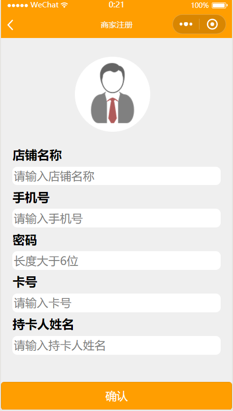

### 商家登录界面

已经注册的商家，每次点击"我是商家"按钮之后就会进入商家登录界面，要求商家输入密码，以验证商家的真实身份。

### 商家管理主界面

商家管理中心如下图所示，商家的小程序端有五项功能，第一项是收支表，第二项是桌位管理，第三项是菜单设置，第四项是排队管理，第五项是更改店铺名，主界面底面是广告栏

### 商家收支表界面

从商家管理主界面点击收支表一栏，则会进入商家收支表界面，这个界面展示了该商家近来一个月，一年的总营业额和总点单数，并且提供自定义的初始日期和结束日期之间总营业额和总点单数的查询

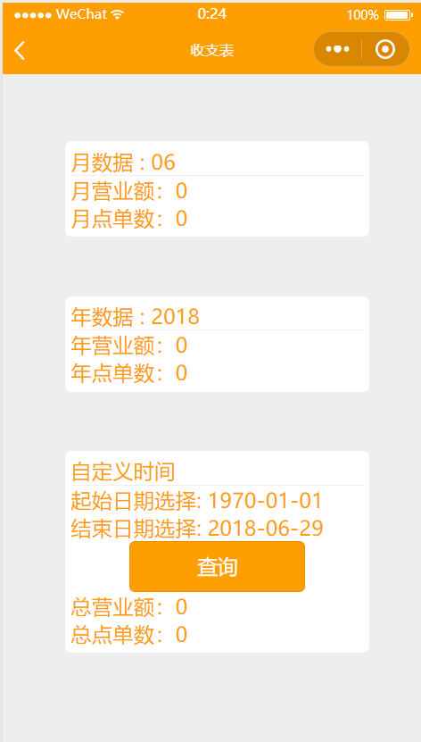

###  商家桌位管理界面

从商家管理主界面点击桌位管理一栏，则会进入商家桌位管理界面，这个界面显示该商家的桌子，商家可以从底部的输入框输入桌子名字来添加桌子

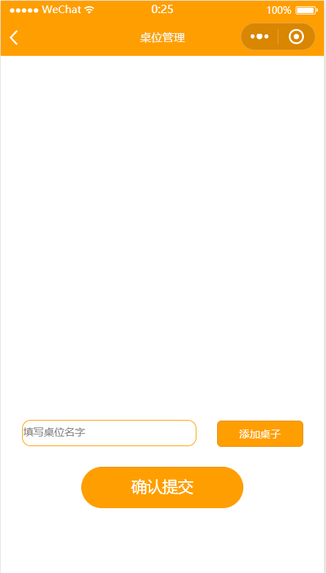

### 商家添加桌子例子

商家一开始添加桌子1，再添加桌子2，然后在商家管理界面就会出现1和2的"桌子"

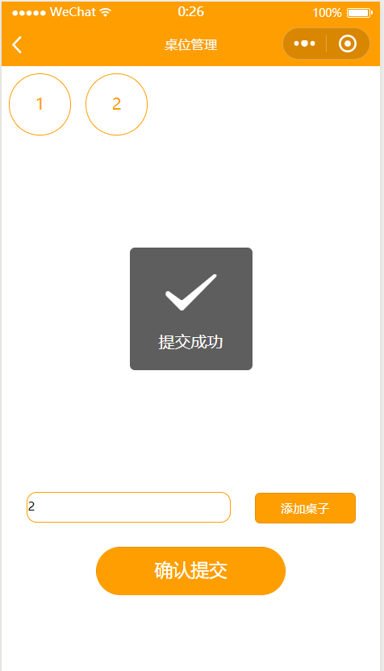

### 商家桌位详情界面

点击1号桌子，进入商家桌位详情界面，该界面有生成对应桌位的二维码，商家可以将这二维码下载到手机打印出来并且定位到对应的桌子上，该界面同时可以删除该桌位。点击删除桌位，则该桌位会被删除

### 商家菜单管理界面

从商家管理主界面点击菜单设置一栏，则会进入商家菜单管理界面，这个界面显示该商家的菜系(比如粤菜，湘菜，闽菜等)。添加新菜系的方法：在输入框中输入新菜系的名字，并且点击"添加新菜系"按钮，则会成功添加新菜系

### 商家添加新菜系例子

在输入框中输入粤菜，并且点击添加新菜系按钮，则添加粤菜菜系成功，如下图所示

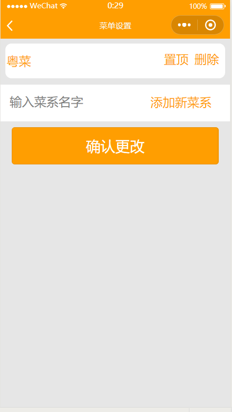

### 商家菜系详情界面

点击粤菜一栏，则会进入粤菜详情界面，这个界面就会显示该菜系所拥有的菜品，如果需要添加菜品，则需要点击添加菜品按钮

### 商家添加菜品界面

点击添加菜品按钮，则会进入菜品添加界面，如下图所示：

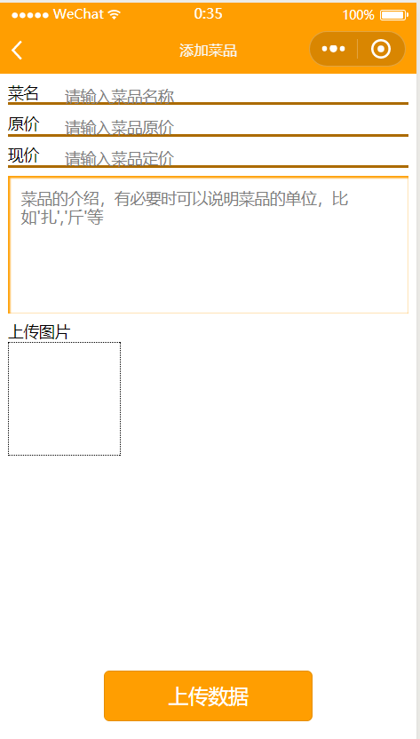

菜品的添加需要输入菜品，原价，现价，菜品的介绍以及菜品的图片，当菜品信息填写完整之后，点击上传按钮，完成添加菜品的操作

###商家添加新菜品例子

当添加一个新菜品白切鸡之后，商家的菜系详情界面如下所示：

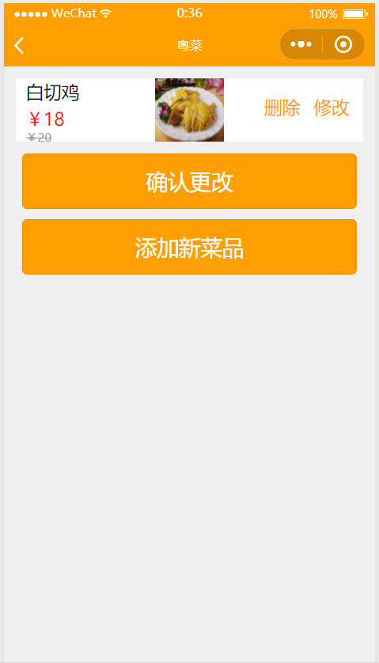

### 商家排队管理界面

从商家管理主界面点击排队管理一栏，则会进入商家排队管理界面，该界面显示了当前该商家的桌位订单，当商家完成订单时候，可以点击完成按钮

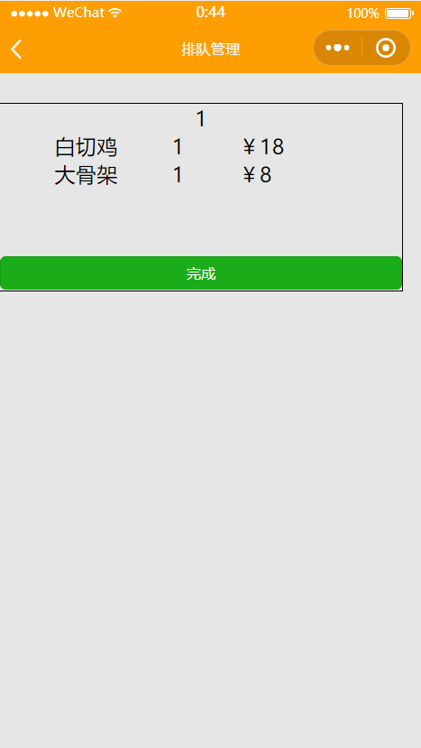

### 商家完成订单界面

当商家完成桌位1的订单之后，点击完成按钮之后的界面如下图所示：

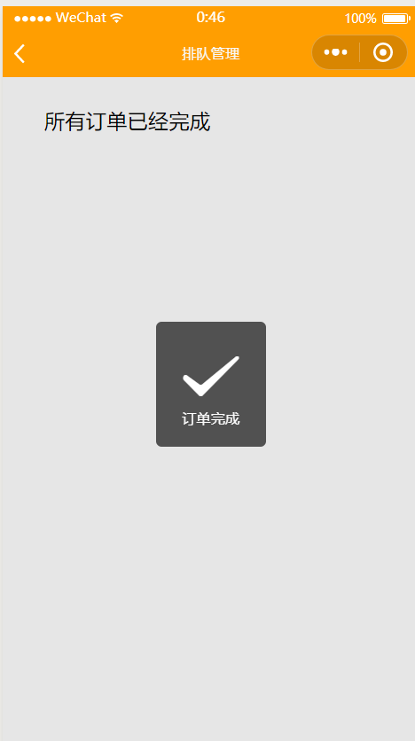

### 商家更改店铺名界面

从商家管理主界面点击更改店铺名一栏，则会进入商家更改店铺名界面，该界面显示了当前商家的店铺名，如果需要更改店铺名，则点击更改店铺名按钮

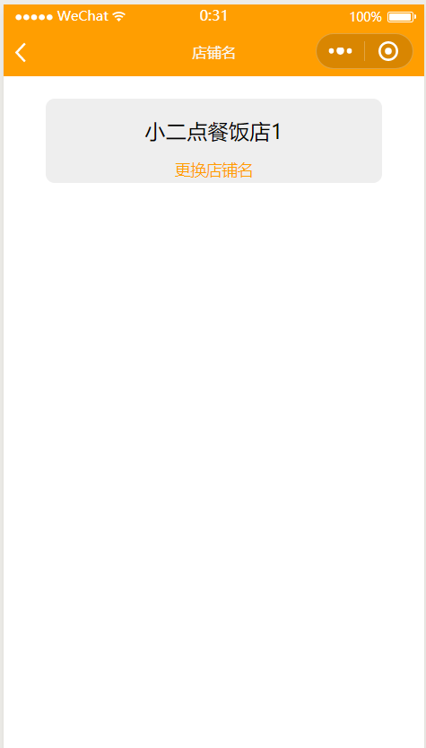

### 商家更改店铺名例子

当商家更改店铺名为小二点餐饭店2之后的界面如下所示：

 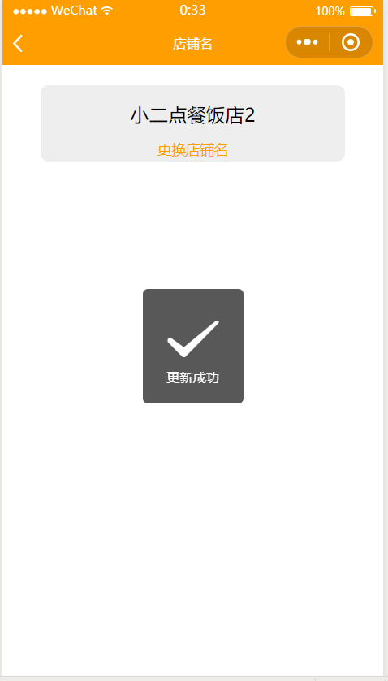

## 顾客手册
###  顾客扫码进入商家菜品页面

点击程序初始界面的"我是顾客"按钮，则会进入扫码界面，顾客扫了商家的桌位二维码之后则会进入商家的菜品界面，这个界面顾客可以点击菜品的加号按钮选择该菜品，当选择完成之后可以点击"去结算"按钮提交订单

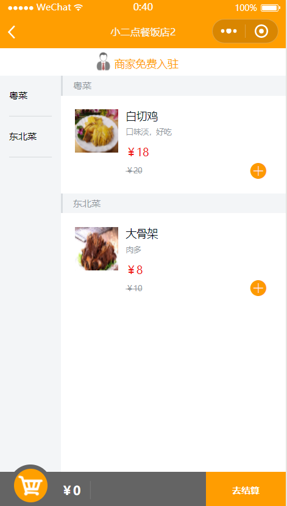

### 顾客购物车添加两个菜品例子

点击白切鸡和大骨架的加号按钮，选择这两个菜品，如下图所示：

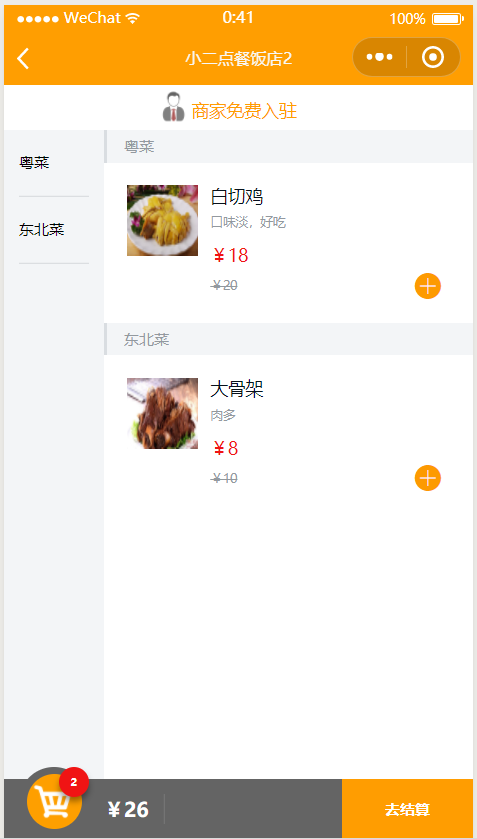

点击购物车按钮，可以弹出顾客选择菜品的详细信息(菜名以及数量等)

### 弹起购物车界面
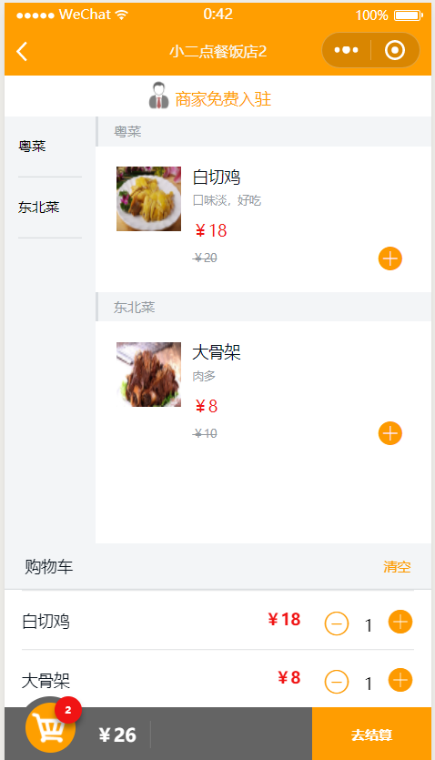

### 顾客结账界面

当顾客点击"去结算"按钮时，则会进入顾客结账界面，在这个界面顾客可以添加备注信息，并且完成结账功能

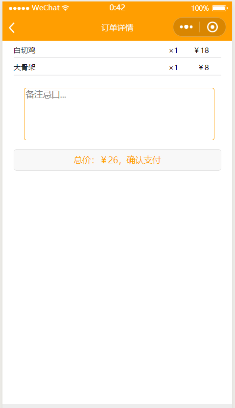

完成结账之后的订单会马上反馈到商家的排队管理界面。

