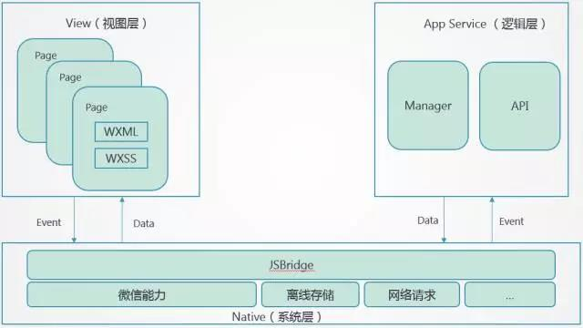
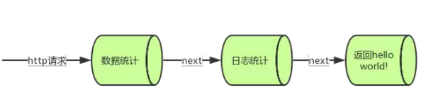

# 软件设计文档

## 环境说明

### 使用到的编程语言
1. nodejs
2. wxml
3. wxss
4. js
5. SQL

### 使用到的开发框架
1. nodejs-Express


## 使用的编程思想
1. ObjectOriented Programming

	面向对象的基本思想是使用类, 对象, 继承, 封装, 消息等基本概念进行程序设计。 面向对象方法的三个基本特征:

* 封装性：将对象的实现细节隐藏起来, 通过一些公共的接口方法来供外部调用对象的功能
* 继承性：是面向对象实现的的重要手段,子类继承父类, 子类直接获得父类的非private属性和方法
* 多态性:子类对象可以赋值给父类对象引用, 但运行的时候仍然表现出子类的行为特征,同一个类型的对象在执行同一个方法时, 可能表现出不同的特征

	在项目中，对各对象、组件进行了封装，只留给外部接口，调用它的其他组件不用知道其内部的具体实现方式，每个组件拥有自己的方法与行为，在解决整个事务的某问题中行使具体职责。同时也实现了模块的划分。例如项目中关于微信小程序的配置文件：wxSever/wxAppConfig.js实现如下：
```js
module.exports =
    {
        oqmenu: {
            'appid':'wx0cb2c043eba33b42',
            'secret':'5f9eb40d8f87ed4a906eec75fc6fcd53',
            'templateid':'0dzNLGwD3ZgAyWfLDyKZupvolZ_IsEdvGhhW8YOUgGE'
        }

    };
```

  定义了微信小程序的基本信息，再别的模块需要这些信息的时候只需要调用这个封装的对象即可，具体例子如下
```js
// 获取微信小程序配置信息对象
var wxApp = require('./wxAppConfig');

    getOpenID = function (js_code, cb) {

    var url = 'https://api.weixin.qq.com/cgi-bin/token?grant_type=client_credential&appid='+ wxApp.oqmenu.appid +'&secret='+wxApp.oqmenu.secret;
    var options = {
        protocol:'https:',
        host: 'api.weixin.qq.com',
        path:'/sns/jscode2session?appid='+wxApp.oqmenu.appid+'&secret='+wxApp.oqmenu.secret+'&js_code='+ js_code.toString()+'&grant_type=authorization_code', // 具体路径, 必须以'/'开头, 是相对于host而言的
        method: 'GET',
        headers: {
            'Accept' : 'text/html,application/xhtml+xml,application/xml;q=0.9,*/*;q=0.8'
        }
    };
    http.get(options, function(res) {
        var resData = "";
        res.on("data",function(data){
            resData += data;
        });
        res.on("end", function() {
            // console.log("%%%%%%%%%%%");
            // console.log(JSON.parse(resData).openid);
            cb(JSON.parse(resData).openid)
        });
    });
};
module.exports = {
    getOpenID : getOpenID
};
```

## 技术选型理由

### 服务端

* nodejs可以解决高并发，它是单线程，当访问量很多时，将访问者分配到不同的内存中，不同的内存区做不同的事，以快速解决这个线程。就像医院的分科室看病人。效率快，但消耗内存大、异步和事件驱动。概扩起来就三点：单线程、异步I/O、事件驱动。nodejs离不开ChormeV8引擎，也就是V8引擎是来解释javascript。用nodejs来搭建高性能的Web服务器，因此node.js是基于服务器端的javascript。js是一种脚本语言可以快速开发，容易维护，适合小型的项目。
* 2009年6月26日，TJ Holowaychuk提交了Express的第一次commit，接下来在2010年1月2日，有660次commits的Express 0.0.1版本正式发布。TJ和Ciaron Jessup是当时最主要的两个代码贡献者。在第一个版本发布的时候，根据github上的readme.md，这个框架被描述成：疯一般快速（而简洁）的服务端JavaScript Web开发框架，基于Node.js和V8 JavaScript引擎。这个框架可以方便我们快速开发出mvc架构的程序，各个中间件也非常丰富，需要的时候可以随时安装引入，可以做到即功能齐全也不至于臃肿。

### 前端
* 使用微信小程序提供的API和编程方法，可以友好的支持各类手机和各位版本微信。出错容易排查，方便部署。

### 数据库
* 使用MySQL，餐饮行业的数据库技术已经非常成熟，存储关系型数据使用MySQL可以有非常高的并发效率，使用标准的SQL可以完成复杂的查找，在我们的排队模块需要用到使用非关系性数据库执行复杂查找难度比较大。

## 架构设计

### 服务端
1. MVC模式
	- Model 
	* 数据结构层，由控制层操作，进行相关数据处理。由于每次SQL的调用只在特定函数中使用，所以项目中我们没有单独把所有操作独立出来，而只独立出了使用的SQL，相关的数据库操作直接嵌套在路由函数中。
	- View
	* express生成项目时会产生views,即前端(我们的项目中前端独立为一个客户端，即微信小程序端)
	- Controller
	* 即视图向控制器发出请求,由控制器选择相应的模型来处理,模型返回的结果给控制器,由控制器来选择合适的视图,生成界面给用户,如通过res.render来渲染jade文件。在express中体现为路由机制。


### 微信小程序端
1. 二层架构
* JS负责业务逻辑的实现，而表现层则WXML和WXSS来共同实现，前者其实就是一种微信定义的模板语言，而后者类似CSS。

架构图如下：

 

* 微信小程序的框架包含两部分View视图层、App Service逻辑层，View层用来渲染页面结构，AppService层用来逻辑处理、数据请求、接口调用，它们在两个线程里运行。视图层使用WebView渲染，逻辑层使用JSCore运行。视图层和逻辑层通过系统层的JSBridage进行通信，逻辑层把数据变化通知到视图层，触发视图层页面更新，视图层把触发的事件通知到逻辑层进行业务处理。


## 设计模式
1. 中间件模式
* 一个请求发送到服务器后，它的生命周期是 先收到request（请求），然后服务端处理，处理完了以后发送response（响应）回去。而这个服务端处理的过程就有文章可做了，想象一下当业务逻辑复杂的时候，为了明确和便于维护，需要把处理的事情分一下，分配成几个部分来做，而每个部分就是一个中间件。

* 比如，我们在开发的过程中经常会遇到数据提交这样一个场景。我们的目的是数据提交，但是在提交之前，我们需要对数据进行验证，验证正确之后，对数据发送进行上报，上报之后才是我们的目标操作提交数据。提交数据之后我们还需要跳转到提交成功的页面。这时候我们一般的做法会是这样：
```js
  if(//验证数据){

  　　//上报数据操作

  　　//提交数据操作

  　　//跳转成功页面

  }
```

​	这时候我们会将整个流程的代码糅合在一起，如果代码简单一点还好，但是如果每一个步骤都有大量的逻辑操作，估计会让人抓狂。 

​	对于这一类的流程事件，我们可以采用分解这些事件，当需要用到这些事件操作时，我们将操作插入到核心事件完成所需要的不同步骤中。我们通过下面的方式来实现提交的功能： 

```js
Function.prototype.before = function(fn){
    var self = this;
    return function(){
        var res = fn.call(this);
        if(res){
            self.call(this,arguments);
        }
    }
};

Function.prototype.after = function(fn){
    var self = this;
    return function(){
        self.call(this,arguments);
        fn.call(this);
    }
};

function report(){
    console.log('上报数据');
    return true;
}

function validate(){
    console.log('验证数据');
    if( + new Date()%2 == 0){
        return true;
    }else{
        return false;
    }    
}

function submit(){
    console.log('提交数据');
}

function goback(){
    console.log('返回首页');
}

submit.before(report).before(validate).after(goback)();
```

​	通过上面的代码，我们将各个阶段的业务给分解开来，这样做的好处很明显，我们只要关注各个阶段的代码实现，最后将各个阶段通过管道式的方式拼装起来。有利于我们代码逻辑的解耦符合我们高内聚低耦合的原则。同时，各部分的代码又独立存在，当其他业务逻辑需要用到的时候，我们只需要把需要的部分取出来，拼装在需要的逻辑上面就可以了。这又有利于代码的复用。

* 但是，上面的代码又有两个问题
  1. 一串长长的链式调用，不方便维护者理解
  2. 如何before或者after的参数是一个异步操作的话，又需要做一些patch

  有没有其他的方法来实现既能隔离业务，又能方便地使用呢。我们来看express的实现方式

* Express中间件的实现
```js
var express = require('express');
var app = express();
 
app.use(function(req, res, next) {
  console.log('数据统计');
  next();//执行权利传递给
});

app.use(function(req, res, next) {
  console.log('日志统计');
  next();
});

app.get('/', function(req, res, next) {
  res.send('Hello World!');
});

app.listen(3000);
//整个请求处理过程就是先数据统计、日志统计，最后返回一个Hello World！
```
* 运作流程图

 

* 再我们项目中的体现：
1. 文件上传部分
  1. 这部分我们定义了引入了一个中间件 `multe`并且定义了一个硬盘存储对象方法	作为每次带有图片数据请求的首次处理函数，定义如下：
```js
var storage = multer.diskStorage({
    //设置上传后文件路径，uploads文件夹需要手动创建
    // 待测试 手动创建
    destination: function (req, file, cb) {
        // console.log("set dist");
        cb(null, './public/images')
    },
    //给上传文件重命名，获取添加后缀名
    filename: function (req, file, cb) {
        var fileFormat = (file.originalname).split(".");
        var icon_name_suffix = (Date.now() + (Math.round(Math.random() * 999)));//生成随机后缀名称
        cb(null, icon_name_suffix + "." + fileFormat[fileFormat.length - 1]);
        req.iconFileName = icon_name_suffix + "." + fileFormat[fileFormat.length - 1];
    }
});
```

  第一个回调函数cb加载对应的路径，第二个回调函数cb将对应的图片名和图片存在对应的路径下。
  在路由函数部分由于这是首先需要调用的部分所以不是用next()函数来触发，而是写在了请求开头，每次的请求首先经过这个中间件的处理然后再由对应的路由处理。具体再项目中的实现如下：
```js
/* 商家添加一个菜品 */
router.post('/addfood', upload.any(), function(req, res, next) {
    // 从连接池获取连接
    console.log("###########添加菜")
    pool.getConnection(function(err, connection) {
        // 获取前台页面传过来的参数
        var param = req.body;
        var files_img = req.files;
        var iconPath;
        if (req.iconFileName) {
            iconPath = req.iconFileName;
        } else if (files_img.length >= 1) {
            iconPath=files_img[0].filename;
        }

        console.log(req);
        // 建立连接 增加一个菜品信息
        connection.query(FoodSql.addFoodInfo, [param.username, param.dishname, param.disholdprice || "null", param.dishprice, iconPath || "null", param.dishdescription, param.dishtypename, param.dishtype], function(err, result) {
            if(result) {
                console.log(result);
                result = {
                    code: 200,
                    msg:'增加成功'
                };
                res.json(result);
            } else {
                res.json({
                    code:403,
                    msg:'增加失败'
                })
            }
            // 以json形式，把操作结果返回给前台页面

            // 释放连接
            connection.release();
        });
    });

});
```
  代码第二行`router.post('/addfood', upload.any(), function(req, res, next)`中`upload.any()`即是一种中间件的方式，先对所有的请求使用upload函数把图片保存和重命名后再有对应的路由去存储非图片的信息到数据库。


## 模块划分

### 服务端部分

1. 项目目录结构
```bash
.
├── app.js
├── bin
│   └── www
├── db
│   ├── BankCardSql.js
│   ├── DbConfig.js
│   ├── FoodSql.js
│   ├── KeySql.js
│   ├── OrderSql.js
│   ├── OrdertailSql.js
│   ├── TableSql.js
│   └── UserSql.js
├── encrypt
│   └── sha1.js
├── fileUpload
│   └── upload.js
├── keyMgr
│   └── keyMgr.js
├── node_modules
├── package.json
├── public
│   ├── images
│   │   └── QR
│   ├── javascripts
│   ├── stylesheets
│   │   └── style.css
│   └── template
│       └── menu.json
├── routes
│   ├── api
│   │   └── v1
│   │       ├── getWxOpenID.js
│   │       ├── searchFood.js
│   │       ├── searchOrder.js
│   │       ├── searchQRcode.js
│   │       └── searchTable.js
│   ├── bankCard.js
│   ├── index.js
│   ├── testdb.js
│   └── users.js
├── server
│   └── serverConfig.js
├── views
│   ├── error.jade
│   ├── index.jade
│   └── layout.jade
├── wxServer
│   ├── getOpenID.js
│   ├── msgTemplate.js
│   └── wxAppConfig.js
└── 变更日志.txt
```

2. 模块划分
  1. 启动模块

     对应文件中的bin/www,这个模块主要完成创建服务器，启动和微信平台的对接，完成获取用户openid的功能。

   * 创建服务器

```js
var server = http.createServer(app);
server.listen(port);
server.on('error', onError);
server.on('listening', onListening); 
```

   * 启动和微信连接

```js
wxTokenGen.startWxService();
```
  2. 获取openid模块
  	对应文件中wxServer目录下文件。
  * 通过小程序的appid和secret使用微信提供的API获取openid
```js
var request = require('request');
var http = require('https');
var querystring = require('querystring');
var wxApp = require('./wxAppConfig');
    getOpenID = function (js_code, cb) {

    var url = 'https://api.weixin.qq.com/cgi-bin/token?grant_type=client_credential&appid='+ wxApp.oqmenu.appid +'&secret='+wxApp.oqmenu.secret;
    var options = {
        protocol:'https:',
        host: 'api.weixin.qq.com',
        path:'/sns/jscode2session?appid='+wxApp.oqmenu.appid+'&secret='+wxApp.oqmenu.secret+'&js_code='+ js_code.toString()+'&grant_type=authorization_code', // 具体路径, 必须以'/'开头, 是相对于host而言的
        method: 'GET',
        headers: {
            'Accept' : 'text/html,application/xhtml+xml,application/xml;q=0.9,*/*;q=0.8',
            'Accept-Encoding' : 'gzip, deflate, br',
            'Accept-Language' : 'zh-CN,zh;q=0.8,en-US;q=0.5,en;q=0.3',
            'Connection' : 'keep-alive',
            'Host' : 'api.weixin.qq.com',
            'Upgrade-Insecure-Requests': 1,
            'User-Agent' : 'Mozilla/5.0 (Windows NT 10.0; Win64; x64; rv:54.0) Gecko/20100101 Firefox/54.0'
        }
    };
    http.get(options, function(res) {
        var resData = "";
        res.on("data",function(data){
            resData += data;
        });
        res.on("end", function() {
            cb(JSON.parse(resData).openid)
        });
    });
};
module.exports = {
    getOpenID : getOpenID
};
```

  3. 数据操作语句模块
    为了方便数据操作我们把用到的SQL语句都独立成一个个独立的模块，对应项目中db目录下的文件。
    其中FoodSql.js实现如下：
```js
var FoodSql = {
    getFoodTypeByUsername:"SELECT * FROM business_dish WHERE Username = ? AND Dishtypename = ?",
    getFoodTypeListByUsername:"SELECT distinct(Dishtypename), Dishtype FROM business_dish WHERE Username = ? ORDER BY Dishtype",
    getFoodListByUsername :"SELECT * FROM business_dish WHERE Username = ? ORDER BY Dishtype",
    getFoodByUsernameAndDishname : "SELECT * FROM business_dish WHERE Username = ? AND Dishname = ?",
    addFoodInfo : "INSERT INTO business_dish(Username,Dishname,DishOldprice,Dishprice,Dishimage,Dishdescription,Dishtypename,Dishtype) VALUES(?,?,?,?,?,?,?,?)",
    deleteFoodInfo : "DELETE FROM business_dish WHERE Username=? AND Dishname=? AND Dishtype = ?",
    deleteTypeInfo : "DELETE FROM business_dish WHERE Username=? AND Dishtypename = ?",
    updateFoodInfo : "UPDATE business_dish SET DishOldprice = ?, Dishprice = ?,  Dishimage = ?,  Dishdescription = ?, Dishtypename = ?, Dishtype = ? WHERE Username=? AND Dishname = ?",
    updateFoodInfoNoImg:"UPDATE business_dish SET DishOldprice = ?, Dishprice = ?, Dishdescription = ?, Dishtypename = ?, Dishtype = ? WHERE Username=? AND Dishname = ?",
    updateTypeInfo : "UPDATE business_dish SET Dishtype = ? WHERE Username=? AND Dishtypename = ?"
};
module.exports = FoodSql;

```
  其他SQL语句模块类似，具体查看项目代码。

  4. 路由模块(API)
  	这部分对应routes模块
  	本项目的API结构如下

- /users
  - /addUser
  - /Checkexist
  - /queryshopname
  - /login
  - /updateName

- /bankcard
  - /delCard
  - /addCard

- /test/db
  - /connectionTest

- /api/v1
  - /searchFood
  	- /
  	- /searchType
  	- /changeType
  	- /queryfood
  	- /addfood
  	- /delfood
  	- /updatefood
  	- /updatefoodnoimg
  - /searchOrder
  	- /
  	- /wechatcheck
  	- /showUnfinishedOrder
  	- /showUnfinishedOrder
  	- /queryOrderByTime
  	- /addorder
  	- /addorderDetail
  - /searchQRcode
  	- /generateQR
  - /searchTable
  	- /
  	- /addtable
  	- /deltable
  - /getOpenID
  	- /

  使用express的router中间件，具体的一个代码实现例子如下：

```js
router.get('/queryshopname', function(req, res, next) {
   console.log("queryshopname");
   pool.getConnection(function (err, connection) {
       var params = req.query || req.params;
       console.log(params);
        connection.query(userSQL.getShopNameByUsername, [params.username], function (err, result) {
            if (result) {
                result = {
                    "err" : 0,
                    "msg" : "查询成功",
                    "shopname": result[0].Shopname
                }

            } else {
                result = {
                    "err" : 1,
                    "msg": "用户名不存在"
                }
            }
            // 以json形式，把操作结果返回给前台页面
            responseJSON(res, result);
            // 释放连接
            connection.release();
        })
   })
});
```
  这个路由完成了查找你个商家的店铺名的功能，提取传递过来的username参数即商家openid，返回数据库查询结果。其他的路由模块逻辑类似，接受参数和数据库语句模块的语句组成sql，并执行sql，返回数据库结果。

### 前端部分

  前端的目录结构如下：

```bash
.
├── app.js
├── app.json
├── app.wxss
├── a.txt
├── images
│   ├── 1.jpg
│   ├── 2.jpg
│   ├── 3.jpg
│   ├── customer.png
│   ├── home.png
│   ├── icon.png
│   ├── left.png
│   ├── list.png
│   ├── menu.png
│   ├── minus.png
│   ├── plus.png
│   ├── scan.png
│   ├── seller.png
│   ├── shopping.png
│   └── table.png
├── pages
│   ├── addDish
│   │   ├── addDish.js
│   │   ├── addDish.json
│   │   ├── addDish.wxml
│   │   └── addDish.wxss
│   ├── businessLogin
│   │   ├── businessLogin.js
│   │   ├── businessLogin.json
│   │   ├── businessLogin.wxml
│   │   └── businessLogin.wxss
│   ├── businessMainPage
│   │   ├── businessMainPage.js
│   │   ├── businessMainPage.json
│   │   ├── businessMainPage.wxml
│   │   └── businessMainPage.wxss
│   ├── businessRegister
│   │   ├── businessRegister.js
│   │   ├── businessRegister.json
│   │   ├── businessRegister.wxml
│   │   └── businessRegister.wxss
│   ├── customerMainPage
│   │   ├── customerMainPage.js
│   │   ├── customerMainPage.json
│   │   ├── customerMainPage.wxml
│   │   └── customerMainPage.wxss
│   ├── index
│   │   ├── index.js
│   │   ├── index.json
│   │   ├── index.wxml
│   │   └── index.wxss
│   ├── logs
│   │   ├── logs.js
│   │   ├── logs.json
│   │   ├── logs.wxml
│   │   └── logs.wxss
│   ├── menuDetail
│   │   ├── menuDetail.js
│   │   ├── menuDetail.json
│   │   ├── menuDetail.wxml
│   │   └── menuDetail.wxss
│   ├── menuManager
│   │   ├── menuManager.js
│   │   ├── menuManager.json
│   │   ├── menuManager.wxml
│   │   └── menuManager.wxss
│   ├── pay
│   │   ├── pay.js
│   │   ├── pay.json
│   │   ├── pay.wxml
│   │   └── pay.wxss
│   ├── payManager
│   │   ├── payManager.js
│   │   ├── payManager.json
│   │   ├── payManager.wxml
│   │   └── payManager.wxss
│   ├── queueManager
│   │   ├── queueManager.js
│   │   ├── queueManager.json
│   │   ├── queueManager.wxml
│   │   └── queueManager.wxss
│   ├── start
│   │   ├── start.js
│   │   ├── start.json
│   │   ├── start.wxml
│   │   └── start.wxss
│   ├── tableDetail
│   │   ├── tableDetail.js
│   │   ├── tableDetail.json
│   │   ├── tableDetail.wxml
│   │   └── tableDetail.wxss
│   ├── tableManager
│   │   ├── tableManager.js
│   │   ├── tableManager.json
│   │   ├── tableManager.wxml
│   │   └── tableManager.wxss
│   ├── updateDish
│   │   ├── updateDish.js
│   │   ├── updateDish.json
│   │   ├── updateDish.wxml
│   │   └── updateDish.wxss
│   └── updateShopname
│       ├── updateShopname.js
│       ├── updateShopname.json
│       ├── updateShopname.wxml
│       └── updateShopname.wxss
├── project.config.json
└── utils
    ├── md5.js
    └── util.js

```


1. 启动模块
<p>微信小程序端的启动模块在app.js文件, 用户启动微信小程序时，启动模块会调用wx.login函数去获得用户的openid，wx.login函数如下所示：</p>
```
wx.login({
      success: function(res) {
        //我的appid：wxb0295a71214e7ca7
        //我的secret:a020b2bc99aa544bb318f8248aab7ef4
        //var appid = 'wx0b3b9d62aac2598e'; //填写微信小程序appid  
        //var secret = '95aaca9fe631361a3ad10213e85d0f40'; //填写微信小程序secret  
        if (res.code) {
          //发起网络请求
          wx.request({
            url: that.globalData.prefixUrl + '/api/v1/getOpenID?js_code=' + res.code,
            header: {
              'Content-Type': 'application/x-www-form-urlencoded'
            },
            success: function(res) {
              console.log(res)
              that.globalData.openID = res.data.openid
              console.log(that.globalData.openID)
              console.log(res.data.openid) //获取openid  
            }
          })
        } else {
          console.log('获取用户登录态失败！' + res.errMsg)
        }
      }
    });
```

2. 角色选择模块
小二点餐微信小程序的初始界面提供用户2种角色选择，一种角色是商家，一种角色是顾客，商家的跳转函数如下所示，该函数首先向服务器发起查询该微信用户是否为商家的请求，如果该用户为商家则直接进入登录界面，如果不是商家则进入商家注册界面。

```
toBusi: function() {
    var that = this;
    wx.request({
      url: app.globalData.prefixUrl + "/users/Checkexist?username=" + app.getOpenid(),
      header: {
        "Content-Type": "application/x-www-form-urlencoded"
      },
      method: "GET",
      complete: function(res) {
        if (res == null || res.data == null) {
          console.error('网络请求失败');
          return;
        }
        console.log(res);
        if (res.data.err == 0) {
          that.setData({
            Username: app.getOpenid()
          });
          wx.navigateTo({
            url: '../businessLogin/businessLogin?username=' + that.data.Username + "&key=" + res.data.accessKey,
          })
        } else {
          wx.navigateTo({
            url: '../businessRegister/businessRegister'
          })
        }
      }
    })

  }

```

顾客的跳转函数如下所示,顾客通过扫餐厅桌子的二维码，二维码储存商家信息和桌子信息，这些信息在跳转函数中会被解析出来并传到顾客模块中

```
  toCust: function() {
    var that = this;
    wx.scanCode({
      success: (res) => {
        console.log(res);
        var url = res.result;
        var username = url.substring(url.indexOf('=') + 1, url.indexOf('&'));
        var tablenum = url.substring(url.lastIndexOf('=') + 1);
        that.setData({
          username: username,
          tablenum: tablenum
        });
        wx.navigateTo({
          url: '../customerMainPage/customerMainPage?username=' + that.data.username + '&tablenum=' + that.data.tablenum
        })
      }
    })
  }
})
```

3. 商家模块
用户进入商家界面之后，商家模块具有五项功能，分别为收支表管理，桌位管理，菜品管理，排队管理以及店铺名管理

  1. 商家模块子模块--收支表管理
商家进入收支表界面，程序则会向服务器发起该商家近一个月以及近一年的收支查询，并且提供用户自行输入起始日期跟结束日期的收支查询，相应代码如下所示

```
wx.request({
      url: app.globalData.prefixUrl + "/api/v1/searchOrder/queryOrderByTime?username=" + options.username + "&timeStart=" + curmonthprev + " 00:00:00&timeEnd=" + curmonthnext + " 23:59:59",
      header: {
        "Content-Type": "application/x-www-form-urlencoded"
      },
      method: "GET",
      complete: function(res) {
        if (res == null || res.data == null) {
          console.error('网络请求失败');
          return;
        }
        console.log(res);
        // 查询
        if (res.data) {
          console.log('查询成功');
          if (res.data.data[0].total == null) {
            res.data.data[0].total = 0;
          }
          that.setData({
            monthnumber: res.data.data[0].cases,
            monthmoney: res.data.data[0].total
          })

        } else {
          console.log('查询错误');
        }
      }
    });
```

  2. 商家模块子模块--桌位管理
商家进入桌位管理界面，系统提供给商家添加，删除，查询桌位的功能，向服务器添加桌子的函数如下所示

```
wx.request({
        url: app.globalData.prefixUrl + "/api/v1/searchTable/addtable",
        header: {
          "Content-Type": "application/x-www-form-urlencoded"
        },
        method: "POST",
        data: {
          username: this.data.username,
          addtablelist: this.addtablelist
        },
        complete: function(res) {
          if (res == null || res.data == null) {
            console.error('网络请求失败');
            that.setData({
              toastHidden: !that.data.toastHidden,
              message: "网络请求失败"
            })
            return;
          }
          console.log(res);
          that.setData({
            toastHidden: !that.data.toastHidden,
            message: "提交成功",
          })
          that.addtablelist = [];
        }
      })
```

删除桌位的函数如下所示

```
wx.request({
      url: app.globalData.prefixUrl + "/api/v1/searchTable/deltable",
      header: {
        "Content-Type": "application/x-www-form-urlencoded"
      },
      method: "POST",
      data: {
        username: this.data.username,
        deltablelist: mydeltablelist,
      },
      complete: function(res) {
        if (res == null || res.data == null) {
          console.error('网络请求失败');
          return;
        }
        console.log(res);
        that.data.deltablelist = [];
        wx.redirectTo({
          url: '../tableManager/tableManager?username=' + that.data.username
        })
      }
    })
```

查询桌位的函数如下所示

```
wx.request({
      url: app.globalData.prefixUrl + "/api/v1/searchTable?username=" + options.username,
      header: {
        "Content-Type": "application/x-www-form-urlencoded"
      },
      method: "GET",
      complete: function(res) {
        if (res == null || res.data == null) {
          console.error('网络请求失败');
          that.setData({
            toastHidden: !that.data.toastHidden,
            message: "网络请求失败"
          })
          return;
        }
        console.log(res);
        that.setData({
          username: options.username,
          Goods: res.data
        });
      }
    })
```

  3. 商家模块子模块--菜品管理

  4. 商家模块子模块--排队管理
商家进入排队管理界面，则系统会向服务器发起查询当前该商家还未完成的订单,查询订单的函数如下所示

```
wx.request({
      url: app.globalData.prefixUrl + '/api/v1/searchOrder/showUnfinishedOrder?username=' + app.getOpenid(),
      header: {
        "Content-Type": "application/x-www-form-urlencoded"
      },
      method: 'GET',
      complete: function(res) {
        console.log("#####排队管理")
        console.log(res)
        if (res == null || res.data == null) {
          console.error('网络请求失败');
          return;
        }
        console.log(res.data.data);
        that.setData({
          tables: res.data.data
        })
      }
    });
```

当商家完成一份订单时候，点击完成按钮，则系统会向服务器发起完成订单的请求：

```
wx.request({
      url: app.globalData.prefixUrl + '/api/v1/searchOrder/setFinished?username=' + app.getOpenid() + '&ordernum=' + orderid,
      header: {
        "Content-Type": "application/x-www-form-urlencoded"
      },
      method: 'GET',
      complete: function(res) {
        console.log(res);
        if (res == null || res.data == null) {
          console.log("网络连接失败");
          wx.showToast({
            title: "网络连接失败",
            icon: "none"
          })
          return;
        }
        let len = that.data.tables.length;
        for (let i = 0; i < len; i++) {
          if (that.data.tables[i].ordernum == orderid) {
            let newTable = that.data.tables;
            newTable.splice(i, 1);
            console.log(newTable);
            that.setData({
              tables: newTable
            })
            break;
          }
        }
        wx.showToast({
          title: "订单完成",
          icon: "success"
        })
      }
    })
```

  5. 商家模块子模块--店铺名管理
当商家进入店铺名管理界面时，首先会向服务器发起请求，获得该商家的店铺名称：


```
wx.request({
      url: app.globalData.prefixUrl + "/users/queryshopname?username=" + app.getOpenid(),
      header: {
        "Content-Type": "application/x-www-form-urlencoded"
      },
      method: "GET",
      complete: function(res) {
        if (res == null || res.data == null) {
          console.error('网络请求失败');
          return;
        }
        console.log(res);
        // 根据openId查询店铺名
        if (res.data.err == 0) {
          console.log('查询店铺名成功');
          that.setData({
            shopname: res.data.shopname
          });
        } else {
          console.log('查询店铺名错误');
        }
      }
    })
```


当商家更改其店铺名时，也会向服务器发起更改商家店铺名的请求


```
wx.request({
      url: app.globalData.prefixUrl + "/users/updateName?username=" + app.getOpenid() + "&newshopname=" + newShopname,
      header: {
        "Content-Type": "application/x-www-form-urlencoded"
      },
      method: "GET",
      complete: function(res) {
        if (res == null || res.data == null) {
          console.error('网络请求失败');
          return;
        }
        console.log(res);
        // 根据openId查询店铺名
        if (res.data.err == 0) {
          console.log('更新店铺名成功');
          wx.showToast({
            title: '更新成功',
            icon: 'success',
            duration: 2000
          })
        } else {
          console.log('更新店铺名错误');
        }
      }
    })
```

4. 顾客模块
当顾客完成扫码时，系统会向服务器发起查询商家所有菜品的请求

```
wx.request({
        url: app.globalData.prefixUrl + "/api/v1/searchFood?username=" + that.data.businessId,
        header: {
          "Content-Type": "application/x-www-form-urlencoded"
        },
        method: "GET",
        complete: function(res) {
          if (res == null || res.data == null) {
            console.error('网络请求失败');
            return;
          }
          console.log(res.data);
          that.setData({
            goods: res.data
          });
        }
      })
```

当顾客点击提交订单按钮时，则系统会向服务器发起提交订单的请求,根据数据库设计原则，此时系统会向服务器发起两次请求

```
wx.request({
      url: app.globalData.prefixUrl + "/api/v1/searchOrder/addorder",
      header: {
        'Content-Type': 'application/x-www-form-urlencoded'
      },
      method: "POST",
      data: {
        ordertail: JSON.stringify(temp_order),
        username: that.data.businessId,
        Ordernumber: that.data.Ordernumber,
        Ordertime: that.data.Ordertime,
        Tablenumber: that.data.Tablenumber,
        Tastenote: that.data.Tastenote,
        Price: that.data.total,
      },
      complete: function(res) {
        console.log("增加订单成功");
        wx.showToast({
          title: '支付成功',
          icon: 'success',
          duration: 2000
        })
      }
    })
```

```
wx.request({
      url: app.globalData.prefixUrl + "/api/v1/searchOrder/addorderDetail",
      header: {
        'Content-Type': 'application/x-www-form-urlencoded'
      },
      method: "POST",
      data: {
        ordertail: JSON.stringify(temp_order),
        username: that.data.businessId,
        Ordernumber: that.data.Ordernumber,
        Orderlen: that.data.bill.length
      },
      complete: function(res) {
        console.log("增加订单详情成功");
      }
    })
```

