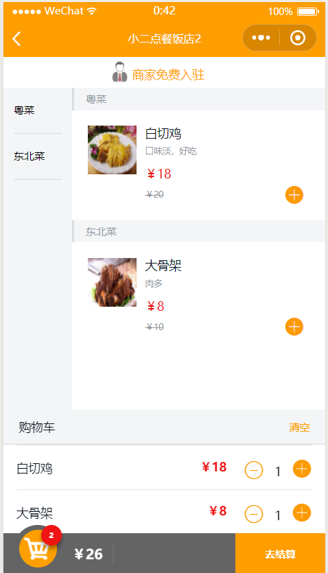
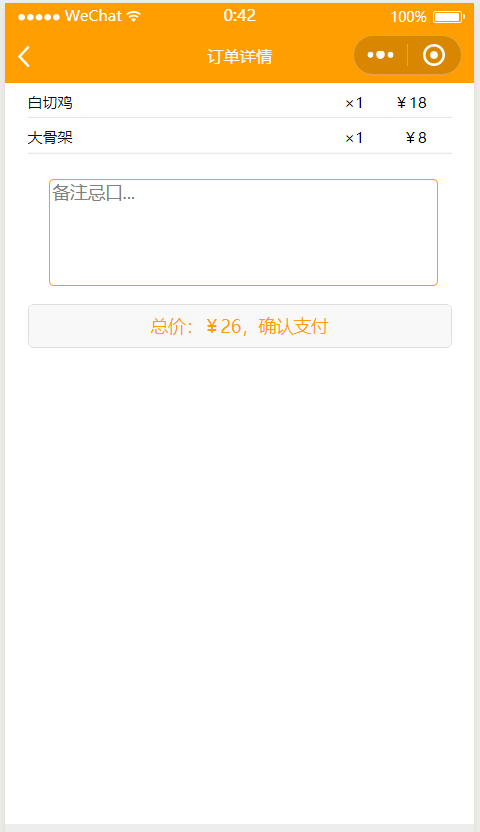
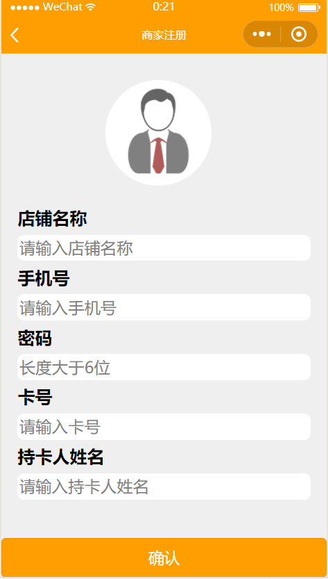

# 软件需求规格说明书

## 一、引言

### 1.1 编写目的

​	软件小二点餐规格说明描述了“XiaoEr”1.0版本的软件功能性需求和非功能性需求。这一文档供参与开发程序以及验证程序功能性的项目团队成员使用。除非在其他地方另有说明，这里指定的所有需求都具有高优先级，并且都要在1.0版本中得以实现。

### 1.2 文档约定

​	编写文档时，所有项目团队成员应该使用Typora软件进行编写，以保持排版和字体等方面的一致性。

### 1.3 读者对象和阅读建议

​	该软件需求规格说明针对开发人员、项目经理、用户及测试人员。本文分别介绍了产品的愿景规划、用户功能、运行环境以及系统的功能点具体描述。

### 1.4 项目范围

​	“XiaoEr”可以方便点餐的客户进行自主下单，也可以帮助饭店减少服务员的开销，只需要一个服务员收银和调度。用户进入商店后使用微信扫描桌面上的二维码即可进入商家的点餐页面开始点餐，点餐完成后商家可以在手机上登录查看目前的排队情况，同时可以管理整个餐厅的菜品和桌号，还可以查看每日的流水，满足小型商家自动点餐需求。

## 二、总体描述
### 2.1.目标
#### 2.1.1、开发意图
​	打造一个简单方便的点餐模式，通过一个手机搞定商家和顾客的点餐难题。

### 2.1.2、产品前景
​	国内最大的生活服务业电商平台美团点评联合自媒体“餐饮老板内参”共同发布《消费 新升级，餐饮新主场：中国餐饮报告(白皮书 2017)》(以下简称“报告”)。这也是首份基 于互联网大数据的餐饮行业报告。报告显示，2016 年，餐饮业全年收入突破 3.5 万亿，同 比增长 11.2%，在 2020 年有望达到 5 万亿元。2016 年全年，仅全国人民吃的火锅就以 7700 亿人民币的总值超过了匈牙利的 GDP。 互联网的力量正在给传统的餐饮行业带来新的增长。2016 年全国餐饮行业的增速为 10%， 但互联网餐饮的增长却高达 300%。微信扫码点餐小程序拥有着巨大的前景空间。 

### 2.1.3、用例图

[小二点餐用例图链接](https://github.com/GiveMeFive-SYSU/Dashboard/blob/master/doc/use_case_diagram/readme.md)

## 三、系统功能

### 3.1 描述和优先级
​	当用户打开微信的时候，首先进入角色选择界面，如果是客户则进行扫码点餐，如果是商家即进入管理页面，选择不同的模块可以对桌位、订单、菜单、店铺名进行管理。同时在商家的页面底部和客户的页面上方留有广告位置，可以对有需求的客户进行广告推广。

### 3.2 请求/相应序列
1. 顾客身份
用户：打开微信扫码并点击我是顾客
响应：服务器向用户返回对应商家的菜品。
用户：选择菜品，点击结算
用户：填写备注，点击结算
响应：返回提交成功。
用户：等待上菜

2. 商家身份
商家：打开微信扫码并点击我是商家
响应：服务器判断是否是注册用户
响应：如果是注册用户放回商家店铺名和今天的收支
响应：如果未注册商家反回注册页面
商家：点击收支表，查询收支
响应：服务器查询数据库后返回商家对应时间段的收支
商家：点击排队管理
响应：服务器返回商家未完成的订单
商家：点击完成订单
响应：服务器返回成功完成一单
商家：点击桌位管理
响应：服务器返回商家的所有桌名
商家：点击桌位
响应：服务器返回商家的对应桌位信息
商家：添加桌位
响应：服务器返回成功添加
商家：点击菜单管理
响应：服务器返回商家的所有菜系
商家：点击菜系
响应：服务器返回商家的对应菜系的所有菜品
商家：添加菜系
响应：服务器返回成功添加
商家：添加菜品
商家：输入菜品信息，并提交
响应：服务器返回成功添加
商家：删除菜品
响应：服务器返回成功删除
商家：修改菜品
响应：服务器返回成功修改
商家：置顶菜系
响应：服务器返回成功置顶
商家：点击更改店铺名
响应：服务器返回商家当前店铺名
商家：输入新店铺名，并提交
响应：返回修改成功

### 3.3 功能性需求

| 功能     |                             描述                             |
| -------- | :----------------------------------------------------------: |
| 用户点餐 |   用户在打开微信后，便能通过扫桌子上的二维码，来进行点菜。   |
| 排队管理 | 商家使用微信进入管理页面后使用排队管理模块，就可以查看和完成订单 |
| 收支管理 | 商家使用微信进入管理页面后使用收支管理模块，就可以查看对应时间段内的订单情况 |
| 更换店名 | 商家使用微信进入管理页面后使用更改店名模块，就可以重新输入店名 |
| 管理桌位 | 商家使用微信进入管理页面后使用桌位管理模块，就可以添加删除管理桌位 |
| 设置菜品 | 商家使用微信进入管理页面后使用菜单管理模块，就可以管理菜系和菜品 |

## 四、界面原型
* 客户端

* 商家

## 五.其他非功能性需求
### 5.1 性能需求
* PE-1: 由于使用的服务器上传速率有限，因此有时候服务器返回相应数据可能需要2-5s的时间，或者更久
* PE-2：由于微信小程序自身的加载性能问题，使用安卓机型的顾客可能在使用该程序时候偶尔会出现卡顿现象，使用IOS系统的顾客则比较少出现卡顿现象

### 5.2 软件质量属性
​	Availability(可用性):小二点餐小程序将对所有联网的商家和顾客可用，服务器24小时不关机，因此商家和顾客可随时访问服务器来使用该程序

### 5.3 其他需求
​	配置需求：小程序服务器部署参考安装说明，由于小程序服务端在本地部署会比较麻烦，因此建议用户访问我们的服务器来使用我们的程序